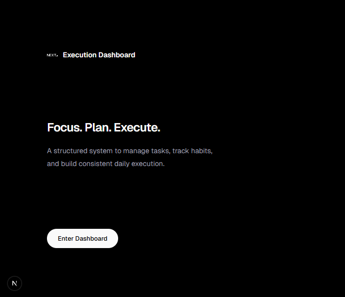
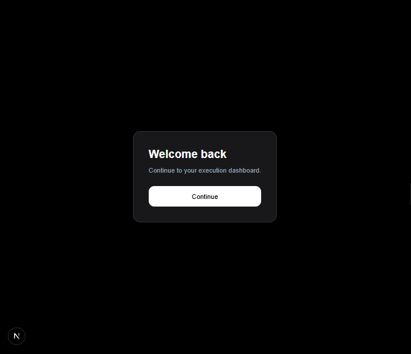
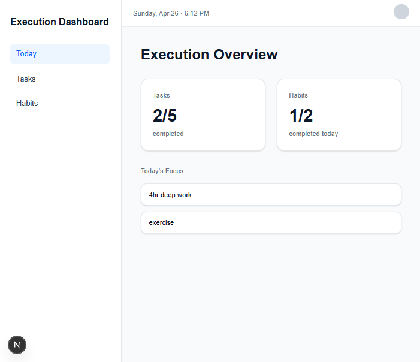
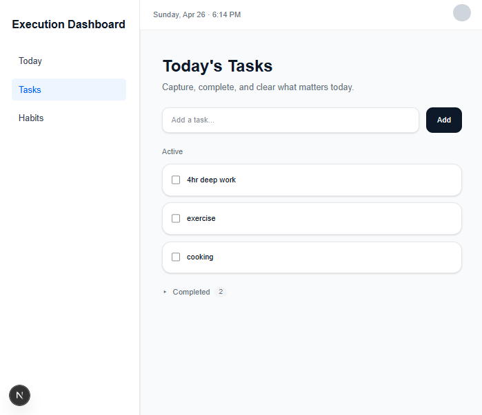
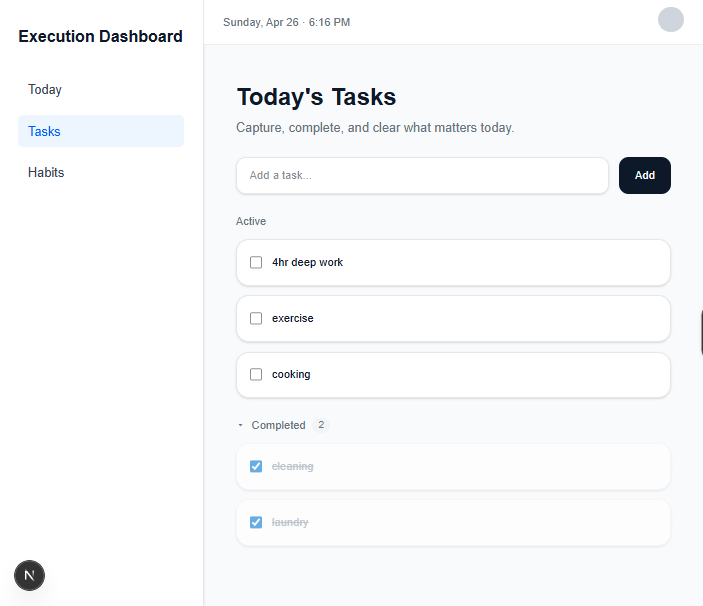
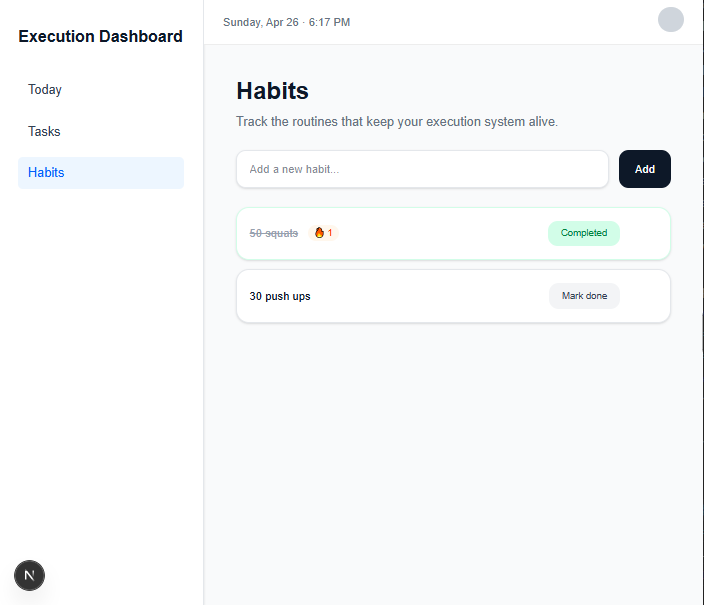
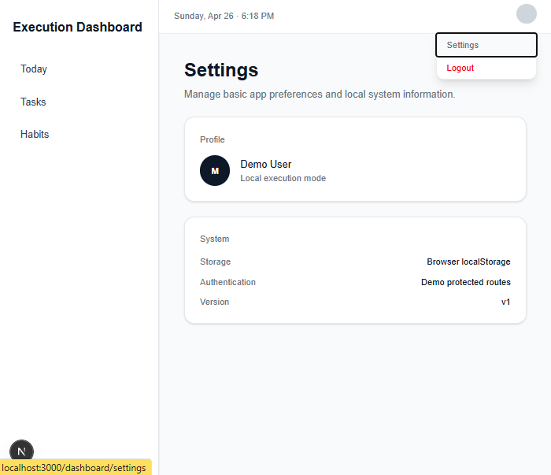

# Execution Dashboard (Desktop Demo)
## 🚀 Live Demo

👉 **Open the Live App**: https://execution-dashboard-kappa.vercel.app/

> Built to model real execution behavior — not just tasks, but consistency and daily action.

### Try the dashboard:
- Login (mock auth)
- Add tasks
- Track habits
- Refresh and see local persistence

> Note: This is a frontend-first version using localStorage for persistence.
A structured execution system built with Next.js and TypeScript, focused on modeling real user behavior through explicit state and persistence.
Best viewed on desktop. Mobile responsiveness is planned for the next iteration.
This project models daily execution through explicit state, consistency tracking, and clean interaction design — focusing on doing, not planning.
<p align="center">
  <a href="https://github.com/Mrylabs/execution-dashboard">
    
  </a>
</p>

---

## ✨ Features

### 📊 Dashboard Overview
- Daily execution summary (tasks + habits)
- “Today’s Focus” highlighting active work
- Real-time date and time awareness

### ✅ Tasks System
- Add, complete, and delete tasks
- Active vs completed separation
- Collapsible completed section
- Local persistence

### 🔁 Habit Tracking
- Daily habit completion
- Streak tracking
- Prevents duplicate completion on the same day
- Visual feedback for completion

### ⚙️ Settings
- Basic profile display
- System information (local mode, storage, version)

### 🔐 Authentication
- Lightweight demo login/logout
- Protected routes

---

## Engineering Highlights

- Structured routing using Next.js App Router with layout-based protection
- Implemented lightweight auth with route guards (frontend prototype)
- Built custom hooks for task and habit state management
- Modeled execution using explicit state and persistent storage
- Designed reusable UI components for scalable interface structure

---

## 🧠 Philosophy

This is not a to-do app.

It is an **execution system**.

- Execution over planning  
- Consistency over perfection  
- Visibility over pressure  

The UI is intentionally minimal to reduce friction and cognitive load.
The goal is not to track tasks, but to make execution visible and measurable.

---

## 📸 Screenshots

### Landing


### Login


### Dashboard


### Tasks



### Habits


### Settings


---

## 🛠 Tech Stack

- Next.js (App Router)
- React + TypeScript
- Tailwind CSS
- LocalStorage (state persistence)

---

## 🚀 Getting Started
```bash
npm install
npm run dev
```
---

## Future Improvements

- Real authentication with JWT and backend integration
- Cloud sync instead of localStorage
- Weekly analytics view
- AI-assisted insights

---

## Why This Project

This project was built to explore how daily execution can be structured through:

- State modeling
- Interaction design
- Consistency tracking
